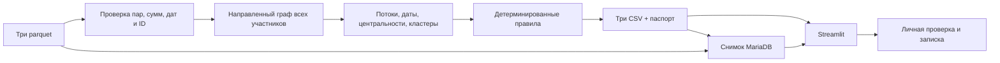

# MoneyGraph — Граф денег

**MoneyGraph помогает аналитику понять, с кого начать проверку в сети денежных
переводов и на каких наблюдениях основан этот выбор.** Из известного участника
можно перейти к отправителям и получателям, проследить цепочку до четырёх шагов,
сравнить суммы и даты и сохранить записку с дальнейшими вопросами.

Проект для кейса HackAlem AI «Граф денег». На предоставленной выборке приложение
обрабатывает **2 248 участников, 3 119 направленных пар и 4 840 переводов** за июль
2026 года. Результат — роли с числовыми объяснениями, группы связанных участников
и топ-20 для проверки. Роли являются аналитическими гипотезами; приоритет
проверки не означает вероятность правонарушения.

В интерфейсе есть вход и регистрация, запоминание входа, интерактивный граф,
поиск по полному ID, личные заметки и экспорт. Готовые данные можно читать из
MariaDB. Расчёт трёх обязательных CSV работает локально, без внешнего API.
AI-расследователь подключается отдельно и запускается только по кнопке.

## Быстрый запуск

Проверенное окружение: **Python 3.14.7** на Linux. Версии зависимостей закреплены
в двух requirements-файлах. Выполняйте команды из корня проекта:

```bash
git clone https://github.com/BAITC-Hacks/hack-cce91bcc-adilet-ai.git
cd hack-cce91bcc-adilet-ai
python3 -m venv .venv
source .venv/bin/activate
python -m pip install -r requirements.txt -r dashboard/requirements.txt
```

**Датасет не публикуется в Git.** Для полного воспроизведения возьмите исходный
набор, предоставленный организаторами или владельцем данных, и разместите три
файла в `data/`:

```text
data/
  nodes.parquet
  edges.parquet
  transactions.parquet
```

Описание схемы и границ выборки: [docs/dataset_README.md](docs/dataset_README.md).
CSV, локальные базы и `.env` также исключены из Git. Если исходных файлов нет,
доступны стартовая страница, синтетические CORE-тесты и подключение к уже
подготовленному снимку MariaDB с разрешённым доступом; расчёт исходного набора
из одного публичного клона невозможен. Приложение не подставляет выдуманные данные.

Рассчитайте результаты и запустите интерфейс:

```bash
python run.py --data ./data --out ./out
python -m streamlit run dashboard/app.py -- --data ./data --out ./out
```

Откройте **http://localhost:8501**, нажмите «Создать аккаунт», укажите имя, email
и пароль из 15–128 символов. Сохраните показанный резервный код, затем войдите.
Email используется как логин; почтовая отправка и подтверждение адреса не подключены.
«Запомнить меня на 30 дней» сохраняет отзывной токен в браузере, а пароль
можно сохранить штатным менеджером паролей браузера.

## Что получает жюри

| Файл | Содержимое | Строк в предоставленном наборе |
|---|---|---:|
| `out/nodes_roles.csv` | Каждый участник, роль, сила правила, приоритет, наблюдения и метрики | 2 248 |
| `out/clusters.csv` | Группы, размер, исходные участники, внутренний оборот и гипотеза | 91 |
| `out/top_nodes.csv` | Упорядоченные кандидаты для проверки с числовым объяснением | 20 |
| `out/run_report.json` | Версии, параметры, время стадий, хеши файлов и чувствительность рейтинга | Один паспорт |

Обязательные колонки [стартового контракта](starter/README.md) сохранены.
`gid` — целое число при расчёте и строка в интерфейсе: длинные ID не округляются
JavaScript. Каждый участник принадлежит ровно одному кластеру, включая
изолированных. При равном приоритете порядок определяется по `gid`, rank начинается
с 1. Поле `evidence` содержит наблюдаемые числа, а не только оценку.

| Роль в CSV | Смысл гипотезы |
|---|---|
| `consolidator` | Собирает наблюдаемые средства от нескольких отправителей |
| `transit` | Получает и отправляет средства дальше |
| `distributor` | Распределяет переводы между получателями |
| `terminal` | Нет наблюдаемого продолжения внутри доступной глубины |
| `coordinator` | Связывает несколько частей наблюдаемой сети |
| `peripheral` | Недостаточно признаков для более определённой роли |

## Проверка решения за 5 минут

1. **Обзор.** Проверьте счётчики 2 248 / 3 119 / 4 840 / 91. Откройте участника
   из начала списка приоритетов или найдите полный `gid` из исходного набора.
2. **Узел и переводы.** Сопоставьте роль, силу правила и приоритет. Посмотрите
   наблюдаемый вход/выход, число контрагентов и вклад каждого признака в оценку.
3. **Цепочка.** В разделе «Кто выше по наблюдаемой цепочке» выберите глубину 1–4.
   На графе одного шага проверьте направление стрелок, суммы и число переводов
   в таблице. Путь показывает связь в наблюдаемом графе, не движение одной суммы.
4. **Проверка ограничений.** Откройте исходного участника (seed), изолированного
   seed и участника на depth=4. Последний не должен автоматически получать роль
   конечного получателя. Предупреждения должны объяснять границы наблюдения.
5. **Сохранение.** Добавьте заметку и статус, нажмите «Сохранить в мои проверки».
   Найдите её в «Мои проверки», скачайте записку, выйдите и войдите снова.
   Другой аккаунт не должен видеть эту заметку.
6. **Проверяемость.** Откройте паспорт и сопоставьте хеши, версии и чувствительность.
   В файловом режиме паспорт создаётся вместе с CSV. Для снимка MariaDB
   проверяется его манифест; это отдельная версия данных.

Подробный сценарий интерфейса и особенности авторизации: [docs/demo.md](docs/demo.md).

Автоматическая проверка после расчёта:

```bash
python -m pytest tests/core tests/ui -q
python bench/verify.py
```

`bench/verify.py` дважды запускает pipeline в отдельных процессах во временные
каталоги, проверяет контракт и побайтовое совпадение трёх CSV, сверяет хеши с
паспортом и печатает wall time. Сам JSON-паспорт содержит изменяющееся время
выполнения, поэтому целиком побайтово не сравнивается.

Без закрытых файлов можно проверить CORE-компоненты:

```bash
python -m pytest tests/core -q
```

Два интеграционных теста будут явно пропущены при отсутствии требуемых данных
или результатов. Полная проверка UI, реального набора и воспроизводимости
требует трёх parquet и рассчитанных CSV.

### Результат контрольного запуска

Проверка 23 сентября 2026 года: **15 CORE-тестов прошли**, обязательные CSV
содержат **2 248 / 91 / 20 строк**. Без приватных файлов: **13 прошли, 2 пропущены**.
Сверены 3 119 пар и 4 840 операций на **365 890 012,01 KZT**, все концы рёбер,
даты июля 2026, суммы с допуском 0,01 KZT, число операций, уникальность и
целочисленность ID.

Проверка всего приложения: **106 тестов CORE/UI прошли**, 5 live-тестов в
обычном прогоне пропущены явно. Отдельный набор с настоящей MariaDB:
**12 тестов прошли**, включая эти пять live-сценариев: изоляцию пользователей,
сохранение заметки через Streamlit, повторный вход, миграцию, конкурентное
восстановление и отзыв сессий. Итого проверены 111 различных тестов.

В Chromium пройден полный пользовательский сценарий на ширине 1440 и 390 px:
ошибка регистрации, вход, сохранение сессии после перезагрузки, заметка,
неизвестный ID, выход и мобильная вёрстка. Команды воспроизведения браузерной
проверки — в [docs/demo.md](docs/demo.md#как-проверяли).
Чтение и проверка готового MariaDB-снимка заняли **2,03 с**; все шесть
контрольных сумм и количества строк совпали.

Два независимых запуска из `bench/verify.py`: **5,43 и 3,97 с**, CSV побайтово
совпали. Отдельный pipeline со временем стадий: **2,80 с**, включая импорты
и паспорт; временные признаки заняли 0,62 с. Замеры зависят от нагрузки машины.
Собственный C++-модуль не требуется: вычисления укладываются в несколько секунд.

По исходным операциям вручную сверены пять категорий: активный seed,
изолированный seed, depth=4, транзитный кандидат и максимальный оборот.
Суммы и число контрагентов совпали. У транзитного кандидата вход и выход равны
90 000 KZT, но только 40 000 KZT совместимы с окном 0–2 дня: `fast2=4/9`.
Это проверка согласованности расчётов, а не измерение точности ролей без разметки.

## MariaDB

Можно использовать уже настроенную MariaDB. Для аналитического чтения и импорта
нужен установленный клиент `mariadb`, доступная база и учётная запись с правами
на используемые таблицы. Сервер автоматически не устанавливается.

Если `.env` ещё нет, создайте его из `.env.example`; существующий файл не
перезаписывайте. Укажите локальные значения:

```dotenv
MYSQL_HOST=localhost
MYSQL_PORT=3306
MYSQL_DATABASE=moneygraph
MYSQL_USER=moneygraph
MYSQL_PASSWORD="ваш пароль"
# MYSQL_SOCKET=/путь/к/mysql.sock
```

`MYSQL_*` читаются из локального `.env` без исполнения его содержимого,
переменные окружения имеют приоритет. Секреты не входят в репозиторий.

При настроенных `MYSQL_*` интерфейс использует MariaDB и для **аккаунтов,
сессий, заметок, истории и AI-кеша**. Эти записи находятся в отдельных таблицах
`mg_workspace_*`; аналитические `mg_*` не меняются. Дополнительный Python-драйвер
не нужен: используется установленный клиент `mariadb`. Сбой БД не переключает
хранилище автоматически, поэтому аккаунты и заметки не «исчезают» в другой базе.

Перенос существующего локального рабочего пространства в MariaDB:

```bash
python -m dashboard.maria_storage --migrate-sqlite data/moneygraph.sqlite3
```

Исходный SQLite-файл читается без изменения. Перенос выполняется атомарно;
повтор для того же пути источника не создаёт дубликаты. Старые хеши паролей,
резервных кодов и токенов сохраняются — перерегистрировать аккаунты не нужно.
Локально проверен перенос двух профилей и одного набора с шестью файлами;
исходная SQLite-база сохранилась.

Для автономного запуска с SQLite укажите путь явно:

```bash
MONEYGRAPH_DB=./data/moneygraph.sqlite3 python -m streamlit run dashboard/app.py
```

Без настроенной MariaDB SQLite создаётся автоматически. Личные проверки
изолированы по аккаунту; исходный аналитический граф общий для пользователей
экземпляра. Пароли хранятся как PBKDF2-HMAC-SHA256 с 600 000 итераций и солью,
сессии и резервные коды — в виде хешей. Выход, смена и восстановление пароля
отзывают соответствующие сессии.

Импортировать рассчитанный снимок вместе с новым расчётом:

```bash
python run.py --data ./data --out ./out --mysql
```

Если снимок уже готов, повторный импорт для просмотра не требуется. В интерфейсе
откройте «Источник данных», выберите MariaDB и нужный снимок. Чтение выполняется
в read-only транзакции; данные проверяются перед отображением. Ошибка соединения
показывается пользователю, а другой набор автоматически не подставляется.

Таблицы аналитики: `mg_runs`, `mg_nodes`, `mg_edges`, `mg_transactions`,
`mg_clusters`, `mg_nodes_roles`, `mg_top_nodes`. `run_id` связывает одну версию
всех таблиц; при SQL-проверке всегда выбирайте конкретную версию. `gid` хранится
как BIGINT, суммы — DECIMAL(24,2), даты — DATE. Все таблицы InnoDB с внешними
ключами. Индекс строки транзакции относится к снимку, не является банковским ID.

Создание таблиц аддитивное. Записи снимка и проверки его размера/суммы выполняются
в одной транзакции. Повтор тех же данных использует те же ключи, новая версия
добавляется отдельно; старые снимки не удаляются. DDL таблиц не откатывается.
Импорт не предназначен для ремонта вручную изменённых записей.

Проверка подключённой базы 23 сентября 2026 года: **MariaDB 11.8.8**, один
аналитический снимок, строки **2 248 / 3 119 / 4 840 / 91 / 2 248 / 20** в шести
таблицах данных. Сумма переводов **365 890 012,01 KZT**, состав кластеров —
2 248 участников; значения совпали с локальным расчётом. Проверка была read-only.

## Технологии и устройство

| Компонент | Технологии | Для чего |
|---|---|---|
| Расчёт | Python, pandas, NumPy, PyArrow | Загрузка parquet, проверка схемы, потоки и даты |
| Граф | NetworkX, SciPy | Направленные метрики, центральности, сообщества |
| Интерфейс | Streamlit, Plotly, HTML/CSS/JavaScript | Рабочее пространство, интерактивный граф и таблица |
| Хранение | MariaDB, SQLite | Аналитические снимки и работа пользователей |
| Проверки | pytest, Streamlit AppTest | Контракт, границы выборки, авторизация и сценарии интерфейса |
| Дополнительный AI | Requests, jsonschema, совместимый API | Ограниченное расследование с проверкой ссылок на факты |



Основные каталоги:

- [`src/`](src/) — валидация, граф, признаки, правила, экспорт, паспорт и импорт MariaDB.
- [`dashboard/`](dashboard/) — интерфейс, авторизация, хранилище и дополнительный AI.
- [`tests/core/`](tests/core/) и [`tests/ui/`](tests/ui/) — проверки расчёта и интерфейса.
- [`bench/verify.py`](bench/verify.py) — проверка воспроизводимости.
- [`starter/`](starter/) — исходный каркас организаторов.
- [`docs/dataset_README.md`](docs/dataset_README.md) — источник сведений о датасете.

### Как назначаются роли и приоритет

До расчёта в граф добавляются все 2 248 участников, включая 19 изолированных
seed. PageRank использует направленные связи с весом по сумме. Приближённый
betweenness: `k=min(128,n)`, `seed=42`, расстояние
`1/max(log1p(sum_kzt),1e-12)` — эвристика силы связи. Сильносвязные компоненты
рассчитываются без перечисления всех путей или циклов.

Louvain использует **ненаправленную проекцию** с суммой обоих направлений и
`seed=42`; ID кластеров определяются по минимальному `gid`. `seed_sources`
считает внешние seed с направленным путём до четырёх рёбер. Формулы и веса
правил v1 находятся в [`src/roles.py`](src/roles.py); семь колонок
`priority_part_*` в сумме дают `priority_score`. Нормирование использует
логарифм и 99-й процентиль положительных значений того же признака.

`fast2` — возможный объём сопоставления входов и выходов за 0–2 календарных дня,
делённый на минимум общих сумм; FIFO использует каждую сумму один раз. Более
ранний выход не сопоставляется с будущим входом. У seed этот сигнал исключён
из временной компоненты приоритета. `pass_through=out_kzt/in_kzt`; без входа
записывается конечный `0` и отдельный `missing_inflow=True`. Этот ноль не
означает отсутствия транзита.

## Ограничения и дальнейшая проверка

- Выборка собрана по исходящим переводам от 81 seed до четырёх колен за
  июль 2026 года. Внешние входящие и продолжения цепочек могут отсутствовать.
- У 444 участников на depth=4 нет наблюдаемых исходящих. Это граница выгрузки,
  поэтому она сама по себе не назначает роль `terminal`.
- В операциях есть дата без времени суток. Совпадение дня показывает возможную
  последовательность, не подтверждает порядок или путь конкретных денег.
- Все суммы относятся только к наблюдаемому графу. Кластер не доказывает
  общее управление, а роль и приоритет не являются доказательством нарушения.
- Размеченных ролей нет: precision/recall и превосходство над другими методами
  не заявляются. Следующий шаг — экспертная разметка и оценка ранжирования.
- Хеши доказывают совпадение файлов, не подлинность исходных банковских сведений.

## AI-расследователь: дополнительный слой

В карточке участника модель может предложить гипотезу, план проверок поддержки
и противоречий и итоговую интерпретацию. Инструменты читают ограниченный срез
реальных данных, а результат проверяется по реестру фактов. Основной pipeline,
роли, приоритет и CSV от API не зависят. Разработка выполнена с Codex.

Настройте переменные из `.env.example`: `AI_ENABLED=true`, `AI_API_KEY`, точный
`AI_MODEL` вашего провайдера и при необходимости `AI_BASE_URL`. Модели по
умолчанию нет. API должен поддерживать Chat Completions, JSON mode
(`response_format=json_object`) и `max_completion_tokens`. URL должен быть
HTTPS без userinfo, query и fragment. SDK не требуется; транспорт — Requests.

AI-настройки читаются из **окружения процесса**, поэтому после редактирования
своего локального `.env` загрузите их перед запуском:

```bash
set -a
source .env
set +a
python -m streamlit run dashboard/app.py -- --data ./data --out ./out
```

В карточке подтвердите отправку фрагмента кейса и нажмите «AI-расследование».
Автоматических запросов при открытии страницы или rerun нет. Полный исходный
датасет, заметки и учётные данные не отправляются. Без настройки модель не
подменяется демонстрационным ответом. Локальная проверка «Что изменится без
этого участника?» работает без API.

<details>
<summary>Пределы, воспроизводимость и проверка AI</summary>

По умолчанию: общий дедлайн 60 с (`AI_TIMEOUT_SECONDS`, 1–180), до восьми
read-only вызовов (`AI_MAX_TOOL_CALLS`, 3–12), до 3 000 выходных токенов на ответ
(`AI_MAX_OUTPUT_TOKENS`, 512–8 000). Возможна одна попытка исправления невалидного
ответа. Контекст ограничен 96 KB, ответ инструмента — 14 KB, ответ API — 128 KB.
Внешний HTTP-запрос выполняется в отдельном процессе для соблюдения дедлайна.

Инструменты: профиль, ограниченное окружение, путь до четырёх шагов, операции,
временная совместимость, транзит, разветвление/схождение, короткие возвраты,
сравнимые участники и локальное исключение узла. Окружение — до 30 узлов,
исходные операции — до 20 строк за вызов, поиск паттернов — до 120 операций;
при усечении показывается ограничение. Полный перечень:
[`dashboard/ai/tools.py`](dashboard/ai/tools.py).

Сопоставление сумм использует ограниченные потоки с ёмкостью операций в тиынах.
Совместимые даты не доказывают движение одной суммы; значения пересекающихся
паттернов не суммируются. Удаление участника показывает изменение структуры,
не предсказывает прекращение реальных переводов.

Кеш проверенных успешных результатов изолирован по пользователю: до десяти,
на 24 часа. Ключ включает хеши данных, `gid`, модель, endpoint, лимиты и версии
промпта/инструментов/правил. API-ключ не входит в кеш-ключ; ошибки не сохраняются
как успех. Метрики usage показываются только когда их вернул API.

Mock-тесты проверяют неверный JSON, ложные ссылки на факты, ID/суммы/период,
дедлайн, rate limit, отсутствие ключа в контексте, кеш и отсутствие повторного
вызова на rerun. Они не оценивают качество настоящей модели. Реальный внешний
AI-вызов в этой проверке не выполнялся.

</details>

## Если что-то не запускается

| Симптом | Действие |
|---|---|
| Нет parquet или CSV | Получите разрешённый исходный набор, проверьте пути в «Источник данных», выполните `python run.py --data ./data --out ./out` |
| Ошибка импорта библиотеки | Активируйте `.venv` и установите оба requirements-файла |
| MariaDB недоступна | Проверьте сервер, клиент `mariadb`, `MYSQL_*`, порт/сокет и права выбранного пользователя |
| Нет аналитического снимка | Выполните pipeline с `--mysql` или выберите локальные файлы |
| Неверный пароль | Используйте восстановление с сохранённым резервным кодом; после пяти неудачных попыток подождите 15 минут |
| AI выключен или недоступен | Проверьте окружение и настройки модели; базовая аналитика продолжает работать |

Приложение — демонстрационный прототип команды, не официальный сервис банка.
Данные и секреты передаются только через согласованный владельцем данных канал.
