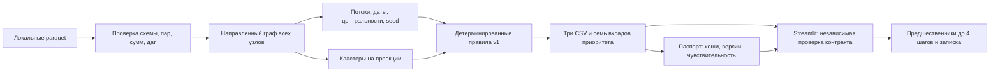

# MoneyGraph — Граф денег

Локальный pipeline CORE по формулам v1. Роли — гипотезы; role_score — сила
правила, priority_score — приоритет проверки, не вероятность правонарушения.
API и сеть для расчёта CSV не нужны. Streamlit включает личные аккаунты, SQLite
и дополнительное AI-расследование по кнопке (настройка ниже).

## Запуск

```bash
python -m venv .venv
source .venv/bin/activate
pip install -r requirements.txt
python run.py --data ./data --out ./out
python -m pytest tests/core -q
```

Нужны data/nodes.parquet, edges.parquet, transactions.parquet. Исходный
starter сохранён в starter/, README датасета — docs/dataset_README.md.
Данные, результаты и секреты исключены из Git.

Результаты: out/nodes_roles.csv, out/clusters.csv, out/top_nodes.csv.
Обязательные поля starter сохранены. Дополнительные поля: missing_inflow,
in_tx, out_tx, fast2, betweenness, scc_size, seed_sources, cross_nbrs,
score_<role>. top_gids — целые gid через `;`. Кластеры от 0, rank от 1.

## Метод и ограничения

Все узлы включаются до метрик. PageRank направленный, вес — сумма.
Betweenness: k=min(128,n), seed=42, расстояние
1/max(log1p(sum_kzt),1e-12), эвристика силы связи. SCC без перечисления циклов.
seed_sources — внешние seed с направленным путём до 4 рёбер.
Louvain: seed=42, ненаправленная проекция с суммой обоих направлений;
ID кластеров по минимальному gid. cross_nbrs — разные соседи других кластеров.

L(x)=clip(log1p(x)/log1p(q99_positive(x)),0,1); квантиль linear по положительным
значениям того же признака, при их отсутствии 0. Формулы ролей и приоритета
v1 без изменений реализованы в src/roles.py. Порог роли .55, равенство:
coordinator, transit, consolidator, distributor, terminal. Иначе peripheral
с силой 1-max(scores), ограниченной .35 для границы depth=4 без исходящих
и изолированных seed. Недопустимые баллы равны 0.

fast2 — возможный объём сопоставления входов и выходов за 0–2 календарных дня,
делённый на минимум общих сумм. FIFO использует каждую сумму один раз.
При отсутствии стороны 0. Совпадение дня не доказывает порядок или путь денег.
У seed входы неполны, fast2 исключён из временной компоненты приоритета.
pass_through=out_kzt/in_kzt; при отсутствии входа 0 и missing_inflow=True.
Этот ноль не доказывает отсутствие транзита. Depth=4 без исходящих — граница
выборки, а не доказанное оседание. Все суммы относятся к наблюдаемому графу.

## Проверка и время

CLI проверяет пары, суммы с абсолютным допуском .01 KZT, количества,
целочисленные gid, концы рёбер, даты июля 2026, роли, конечность, кластеры
и сортировку. Тесты включают синтетические границы и локальный датасет.
CLI печатает JSON со строками CSV и временем стадий, включая импорт.

```bash
time python run.py --data ./data --out ./out
python run.py --data ./data --out /tmp/moneygraph-repeat
diff out/nodes_roles.csv /tmp/moneygraph-repeat/nodes_roles.csv
diff out/clusters.csv /tmp/moneygraph-repeat/clusters.csv
diff out/top_nodes.csv /tmp/moneygraph-repeat/top_nodes.csv
```

Проверено на Fedora, Python 3.14: 10 тестов прошли (повторно за 2.23 с).
Реальные CSV: nodes_roles — 2248 строк, clusters — 91, top_nodes — 20.
Сверены 3119 пар и 4840 транзакций, сумма 365890012.01 KZT; включены
19 изолированных seed, 444 узла на границе глубины не названы terminal.
Все три CSV побайтово совпали при повторном запуске.

Полный первый запуск по выводу терминала — 3.54 с, повторный — 2.78 с
(включая импорт, без старта интерпретатора). Стадии повторного запуска:
импорт 1.289 с, загрузка/проверка .156 с, граф .026 с, признаки .027 с,
временные признаки .534 с, центральности .339 с, кластеры .130 с,
роли/приоритет .032 с, экспорт .243 с. C++ не требуется: полный запуск
укладывается в 4 с, крупнейшая вычислительная стадия занимает .534 с.
Версии проверенного окружения зафиксированы в requirements.txt.

Проверены пять реальных примеров по исходным транзакциям: активный seed,
изолированный seed, узел depth=4, транзитный кандидат и узел с максимальным
суммарным входом/выходом. Для каждого совпали суммы и число контрагентов.
У транзитного кандидата из 90000 KZT входа и 90000 KZT выхода только
40000 KZT можно сопоставить в окне 0–2 дня: fast2=4/9. Более ранние выходы
не сопоставляются с будущими входами. Это согласованность правил, не
измерение точности классификации без разметки.

Осталось организационно: создание ветки agent/core и коммит не выполнены
(доступ к .git ранее не разрешён); интеграция и проверка dashboard относятся
к UI-агенту. Данные и CSV не публиковались.

## Задача Freedom и архитектура решения

Предоставленное описание трека: AML-аналитик видит нижний уровень цепочки
и восстанавливает по переводам на четыре колена, кто выше собирает и
распределяет деньги. Основной сценарий MoneyGraph: известный gid →
наблюдаемые предшественники → объяснение приоритета → записка для проверки.
Полная шкала оценки жюри и дополнительные материалы трека не предоставлены.



Границы ответственности:

- `src/load.py` отвергает неконсистентные данные до расчёта.
- `graph.py`, `features.py`, `temporal.py`, `communities.py` считают наблюдения.
- `roles.py` — единственный источник формул ролей и приоритета.
- `export.py` проверяет контракт и записывает результаты.
- `report.py` сохраняет `out/run_report.json`: SHA-256 входов, исходного кода
  и CSV, версии библиотек, параметры, время стадий, сравнение с базовым
  рейтингом и чувствительность. Поле seconds.total в паспорте относится
  к расчёту до создания паспорта; итог CLI включает и его создание.
- `dashboard/data.py` проверяет экспорт независимо; UI не назначает роли.
- `dashboard/investigation.py` ищет один кратчайший направленный путь от
  каждого наблюдаемого предшественника к выбранному узлу: обратный BFS
  до 4 шагов, максимум 20 кандидатов по готовому приоритету. Это не
  восстановление движения конкретных денег и не доказательство иерархии.

Дополнительные `priority_part_*` в nodes_roles — семь взвешенных слагаемых,
их сумма равна priority_score. Формулы v1 и обязательные поля не изменены.
Записка скачивается локально пользователем из карточки; внешних вызовов нет.

## Проверка перед демонстрацией

Проверенное окружение: Python 3.14, Streamlit 1.64.0, Plotly 6.9.0;
версии прямых UI-зависимостей и CORE закреплены в requirements.

```bash
source .venv/bin/activate
python -m pip install -r requirements.txt -r dashboard/requirements.txt
python run.py --data ./data --out ./out
python -m pytest tests/core tests/ui -q
python bench/verify.py
python -m streamlit run dashboard/app.py -- --data ./data --out ./out
```

`bench/verify.py` дважды запускает pipeline в отдельных процессах во
временные каталоги, сверяет контракт, SHA-256 трёх CSV и паспорт. Измеряет
wall time вместе со стартом интерпретатора. Отчёт JSON намеренно не
побайтово детерминирован: времена запуска меняются, CSV детерминированы.

В реальном наборе топ-20 совпадает с простым рейтингом по
max(in_kzt,out_kzt) в 8 из 20 случаев. При исключении одного компонента
сохраняется от 14 до 20 позиций топ-20. Это анализ зависимости от правил,
не доказательство точности. На странице «Проверяемость» можно проверить
каждую величину. Хеши не являются цифровой подписью или гарантией
подлинности исходного датасета.

### Что показывать жюри

1. Начать с известного узла и показать предшественников до 4 шагов.
2. Объяснить роль через числа и приоритет через семь вкладов.
3. Показать направленные пары и проверить одну связь в исходной таблице.
4. Скачать записку с фактами и ограничениями для дальнейшей проверки.
5. Открыть паспорт, результаты тестов и повторяемость запуска.

Без размеченных ролей нельзя честно заявить precision/recall или
восстановление доказанной организованной группы. Следующее улучшение при
доступе владельца задачи — экспертная разметка контрольных узлов и оценка
качества ранжирования; текущая версия готовит проверяемые гипотезы.

Последняя проверка после расширения сценария Freedom: **25 tests passed**,
без пропусков, включая Streamlit AppTest (9.76 с). Два полных процесса
pipeline — **2.87 и 3.84 с**, CSV побайтово одинаковы; 2248/91/20 строк.
Нативное ускорение не требуется. Внешний вид в браузере остаётся отдельной
ручной проверкой; headless-тест не заменяет её.

## AI-расследователь: дополнительный слой

В карточке клиента доступен сценарий «Факты → гипотеза → проверки поддержки и
противоречий → вывод». Один агент сначала предлагает ограниченный план, затем
получает результаты выбранных read-only инструментов и формулирует ответ.
Основной pipeline, формулы ролей и `priority_score`, три обязательных CSV и
авторизация по email/паролю не зависят от модели.

### Установка и настройки

```bash
source .venv/bin/activate
python -m pip install -r requirements.txt -r dashboard/requirements.txt
cp .env.example .env
```

Откройте локальный `.env` и задайте `AI_API_KEY`, `AI_MODEL` и
`AI_ENABLED=true`. Модель по умолчанию намеренно отсутствует: используйте
точный идентификатор модели вашего провайдера. Ключ не публикуйте.
`AI_BASE_URL` — HTTPS base URL OpenAI-совместимого API, по умолчанию
`https://api.openai.com/v1`; адаптер добавляет `/chat/completions`.
Endpoint не может задаваться моделью; редиректы запрещены.

| Переменная | Значение и ограничение |
|---|---|
| `AI_ENABLED` | `false` по умолчанию; AI не запускается автоматически |
| `AI_API_KEY` | Только окружение сервера, пустой ключ в примере |
| `AI_BASE_URL` | HTTPS base URL без userinfo, query и fragment |
| `AI_MODEL` | Обязательное имя модели с JSON mode и Chat Completions |
| `AI_TIMEOUT_SECONDS` | Общий дедлайн 60 секунд, допустимо 1–180 |
| `AI_MAX_TOOL_CALLS` | 8 по умолчанию, допустимо 3–12, включая исходный профиль |
| `AI_MAX_OUTPUT_TOKENS` | 3000 на ответ, допустимо 512–8000 |

Загрузите переменные в **своём локальном терминале** и запустите сайт:

```bash
set -a
source .env
set +a
python run.py --data ./data --out ./out
python -m streamlit run dashboard/app.py -- --data ./data --out ./out
```

Приложение не читает `.env` автоматически. В hosted-среде задавайте те же
переменные окружения на сервере. При отсутствии ключа/модели UI показывает,
какую настройку заполнить; таблицы, граф, БД и локальная симуляция продолжают работать.
Нет демонстрационного ответа, который выдаётся за реальный вызов.

Транспорт использует установленный Requests, без отдельного OpenAI SDK.
Контракт сверялся с [OpenAI Structured Outputs](https://developers.openai.com/api/docs/guides/structured-outputs),
[Function calling](https://developers.openai.com/api/docs/guides/function-calling)
и [Requests Advanced Usage](https://requests.readthedocs.io/en/latest/user/advanced/).
Используется JSON mode (`response_format=json_object`) и `max_completion_tokens`;
строгая схема проверяется локально через jsonschema. Провайдер должен поддерживать
эти параметры. Выбор инструментов возвращается как JSON-план, не как исполняемый код.
Requests имеет таймауты сокета, поэтому каждый HTTP-запрос выполняется в отдельном
процессе: при исчерпании оставшегося общего времени процесс завершается.
Это позволяет прервать даже медленный ответ или DNS. Новых нативных модулей нет.

### Демонстрация

1. Зарегистрируйтесь или войдите; на обзоре откройте приоритетный gid.
2. В конце карточки найдите «AI-расследователь». Ознакомьтесь с уведомлением
   о внешнем API и разрешите отправку фрагмента кейса.
3. Нажмите **«AI-расследование»**. Этапы показывают фактическую подготовку,
   планирование, вызовы инструментов, контрпроверки и валидацию ответа.
4. Сопоставьте интерпретацию с вычисленными фактами. Раскройте evidence_id,
   проверьте исходные операции, номера строк и версию входных файлов.
5. Нажмите **«Что изменится без этого участника?»**: это локальная проверка
   копии графа без запроса к модели. Скачайте Markdown и реестр доказательств JSON.
6. Повторное нажатие использует проверенный кеш; обычные Streamlit rerun не
   запускают расследование. UI показывает модель, версию, время и факт кеша.
   Токены отображаются только из реально присутствующего в API поля usage.

### Архитектура и границы проверки

- `dashboard/ai/evidence.py`: снимок файлов, SHA-256, реестр фактов и точные
  исходные строки. ID транзакции = файл + префикс версии + индекс от нуля;
  одинаковые строки различаются индексом, изменение файла меняет версию.
- `tools.py`: семь фиксированных инструментов, JSON-схемы аргументов и проверки
  области кейса. Никаких Python/SQL/shell/произвольных URL от модели.
- `provider.py`, `http_worker.py`: серверный Chat Completions транспорт,
  ограничение ответа и два суммарных повтора для network/429/5xx. Тела ошибок,
  заголовки авторизации и ключ не возвращаются в UI, экспорт или логи приложения.
- `schema.py`: структура плана/вывода, обязательная контрпроверка, существование
  evidence_id и соответствие gid, периода, метрики и значения. Числа в свободном
  тексте запрещены: UI берёт их из реестра. Альтернативы явно помечены предположениями.
- `engine.py`: максимум две обычные генерации и одна общая попытка исправления
  структуры/доказательств в том же дедлайне. При ошибке остаются факты без AI-вывода.
- `ui.py`: фрагмент Streamlit после базовых результатов, запуск только по кнопке.
  Подготовленные результаты остаются между rerun; сбой AI не скрывает базовый граф.

Кейс ограничен 80 узлами обхода до четырёх шагов (соседи по возрастанию gid).
Окружение возвращает максимум 30 узлов; исходные транзакции — максимум 20 за
вызов, с явным флагом неполного среза. Временной путь — простой путь до пяти
узлов и 400 операций. Поиск паттернов использует максимум 120 первых операций
по дате и ID, исключает самопереводы и показывает, если часть операций не вошла.
Контекст запроса ограничен 96 KB, ответ инструмента — 14 KB, ответ API — 128 KB.
Полные исходные строки остаются локально; в API идут компактные факты и ссылки.
Заметки и пользовательские учётные данные не входят в контекст.

Временная совместимость вычисляется максимальным потоком по временным слоям;
каждая операция имеет ёмкость в тиынах и не может использоваться сверх суммы.
Сопоставление транзита — двудольный поток с окном до двух дней. Отдельно считаются
неубывающие даты и строго возрастающие даты. Более ранний выход не сопоставляется
с будущим входом. Совпадение дня и совместимая цепочка не доказывают движение
конкретных денег. Значения пересекающихся паттернов **не суммируются**.

Похожие участники: одинаковые seed/boundary-флаги, суммарный наблюдаемый вход+выход
и количество входящих+исходящих переводов в диапазоне 0.5–2 от выбранного узла.
Выбираются до восьми ближайших по нормированному отклонению, затем gid;
менее трёх — недостаточная группа. Удаление показывает слабую связность всего
наблюдаемого графа и пути до четырёх шагов между первыми десятью предшественниками
и десятью получателями. Это структурная чувствительность, не доказательство
экономического эффекта, общего контроля или прекращения переводов.

JSON-схема и точные ссылки **не гарантируют истинность свободной интерпретации**.
Все её формулировки остаются гипотезами для аналитика. Неполные входящие seed,
граница глубины и отсутствие времени суток сохраняются как явные ограничения.
Без разметки не заявляются precision/recall или превосходство над другими решениями.

Кеш проверенных успешных результатов хранится в SQLite `ai_results`, отдельно
для пользователя: до десяти результатов, срок 24 часа. Ключ включает SHA-256
входов/CSV, gid, endpoint, модель, лимиты, версии промпта/инструментов/правил;
API-ключ в него не входит. Ошибки не кешируются как успех. При изменении логики
проверок версии в `config.py` должны обновляться.

### Что проверено

Синтетические и mock-тесты проверяют свойства вычислений и оркестрации, **не
качество настоящей модели**. Они покрывают последовательные, обратные и
однодневные даты, повторяющиеся операции и двойной учёт, seed/depth-boundary,
ложный evidence_id, неверные gid/период/сумму, лимиты, таймаут, rate limit,
невалидный JSON, единственную попытку исправления, инвалидирование кеша,
сохранность графа после удаления и отсутствие ключа в контексте/экспорте.
AppTest проверяет запуск по кнопке, отсутствие API на rerun, кеш и локальное удаление.

На пяти реальных узлах (активный seed, изолированный seed, depth=4, transit,
максимальный оборот) суммы профиля совпали с исходными расчётами. Загрузка и
проверка снимка — 0.376 с, отдельные инструменты — 0.004–0.030 с после загрузки.
C++ не требуется. Реальный API не вызывался: ключ и модель не настроены.

Итоговая проверка: **59 тестов прошли за 40.47 с**. Два запуска базового
pipeline — **5.07 и 4.53 с**, обязательные CSV побайтово совпали:
**2248 строк nodes_roles, 91 clusters, 20 top_nodes**. Проверены и существующие
сценарии авторизации/сохранения. `git diff --check` проходит. Внешний вид в
браузере и качество вывода настоящей модели этой проверкой не оценивались.

```bash
python -m pytest tests/core tests/ui -q
python bench/verify.py
```

## Аналитическое хранилище MariaDB

Опциональная загрузка использует установленный клиент `mariadb`, без нового
Python-драйвера или нативного модуля. База и пользователь должны существовать.
Задайте `MYSQL_HOST`, `MYSQL_PORT`, `MYSQL_DATABASE`, `MYSQL_USER`,
`MYSQL_PASSWORD` в локальном `.env` (см. `.env.example`). Переменные окружения
имеют приоритет. Для значений с пробелами или `#` используйте кавычки.
Только модуль импорта читает `MYSQL_*`; содержимое `.env` не исполняется.

```bash
source .venv/bin/activate
python run.py --data ./data --out ./out --mysql
```

`src/database.py` проверяет исходный и выходной контракт и сохраняет:

- `mg_runs`: SHA-256 снимка, версия схемы, время и манифест с хешами/числом строк;
- `mg_nodes`: все узлы, включая изолированные seed;
- `mg_edges`: направленные агрегированные связи;
- `mg_transactions`: отдельные операции с датой и индексом внутри снимка;
- `mg_clusters`, `mg_nodes_roles`, `mg_top_nodes`: результаты расчёта.

Все таблицы InnoDB, `gid` — BIGINT, суммы — DECIMAL(24,2), дата — DATE.
Связи защищены составными внешними ключами с `run_id`. Обязательные поля ролей
хранятся в отдельных колонках, дополнительные метрики — в JSON `metrics`.
Индексы поддерживают выборку входов/выходов по дате, кластер и приоритет.
Индекс транзакции идентифицирует строку сортированного снимка, а не банковский
ID; одинаковые исходные операции остаются отдельными записями.

Создание таблиц аддитивное. Записи одного снимка и проверки количества/суммы
выполняются одной транзакцией: ошибка прерывает batch и закрытие соединения
откатывает незавершённые записи. DDL таблиц не откатывается. Повтор снимка
использует те же первичные ключи; новые данные или результаты создают новую
версию, старые версии не удаляются. Разные версии различаются `run_id`:
при аналитических SQL-запросах всегда выбирайте один снимок, чтобы не
суммировать версии вместе. Внешние изменения импортированных строк не
поддерживаются; импорт не служит инструментом ремонта вручную изменённой БД.

Пароль передаётся клиенту через временный конфигурационный файл `0600`,
удаляемый после вызова. SQL-строки кодируются в UTF-8 hex, идентификаторы
таблиц заданы кодом. Ошибки не выводят SQL, данные или пароль.
Основной запуск без `--mysql` не требует БД. Аккаунты, заметки и AI-кеш
интерфейса продолжают использовать существующее SQLite-хранилище; миграция
этого хранилища в MariaDB не входит в аналитический импорт.

Проверка кода импорта:

```bash
python -m pytest tests/core -q
```

После загрузки можно проверить записи, подключившись через
`mariadb -u moneygraph -p moneygraph`:

```sql
SELECT run_id, created_at, manifest FROM mg_runs ORDER BY created_at DESC;
SELECT run_id, COUNT(*) FROM mg_nodes GROUP BY run_id;
SELECT run_id, COUNT(*), SUM(sum_kzt) FROM mg_transactions GROUP BY run_id;
```

Живая запись и повторная загрузка MariaDB в среде агента пока не проверены:
доступ к сокету из песочницы отсутствует, запуск за её пределами не разрешён.
