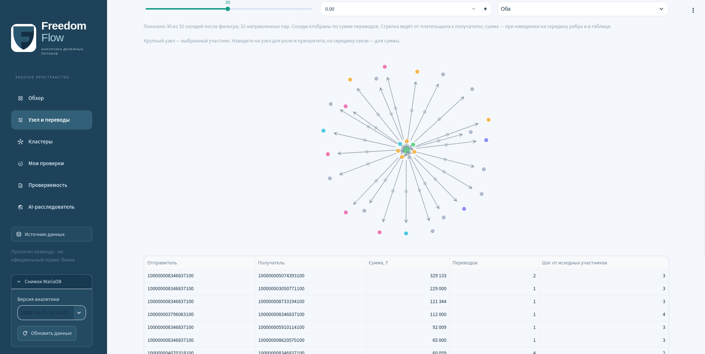

# Freedom Flow

**Аналитика денежных потоков · Money-flow analytics · Ақша ағындарын талдау**

HackAlem AI · «Граф денег»

[Русский](#ru) · [English](#en) · [Қазақша](#kk)



<a id="ru"></a>

## Русский

### Что решает Freedom Flow

**Freedom Flow помогает аналитику понять, с кого начать проверку в сети денежных переводов и на каких наблюдениях основан этот выбор.** Можно найти участника по полному ID, изучить связи до четырёх шагов, сравнить суммы и даты и сохранить личную записку с дальнейшими вопросами.

Проект разработан для кейса HackAlem AI «Граф денег» с использованием Codex. На предоставленной выборке за **июль 2026 года** он обрабатывает **2 248 участников, 3 119 направленных пар и 4 840 переводов**, выделяет **91 кластер** и формирует топ-20 для проверки. Роли — аналитические гипотезы; приоритет не означает вероятность правонарушения. Freedom Flow — демонстрационный прототип команды, не официальный сервис банка.

### Возможности

- **Русский, English, Қазақша:** язык интерфейса сохраняется при обновлении страницы и повторном входе. Исходные тексты данных, заметки и исходные выгрузки остаются на своём языке.
- **Личный кабинет:** регистрация, вход, «Запомнить меня на 30 дней», восстановление по резервному коду. Меню пользователя, выход и смена пароля — по иконке в правом верхнем углу.
- **Аналитика:** поиск без округления длинных ID, фильтры, направленный граф, таблицы переводов, кластеры и числовое обоснование приоритета.
- **Мои проверки:** личные статусы, заметки и экспорт записки, привязанные к аккаунту и версии данных.
- **AI-расследователь:** проверка выбранного участника и кнопка «Расследовать следующую цепочку». Каждое расследование запускается вручную после согласия на отправку ограниченного контекста.

### Быстрый запуск

Проверенное окружение: **Linux, Python 3.14.7**. Версии зависимостей закреплены в двух requirements-файлах. Команды выполняются из корня репозитория; для клонирования нужен доступ к нему.

```bash
git clone https://github.com/BAITC-Hacks/hack-cce91bcc-adilet-ai.git
cd hack-cce91bcc-adilet-ai
python3 -m venv .venv
source .venv/bin/activate
python -m pip install -r requirements.txt -r dashboard/requirements.txt
```

**Исходный датасет не публикуется в Git.** Получите разрешённый набор у организаторов или владельца данных и разместите три файла:

```text
data/
  nodes.parquet
  edges.parquet
  transactions.parquet
```

Схема и границы выборки: [описание датасета](docs/dataset_README.md). CSV, локальные базы и `.env` также исключены из Git. Без этих parquet доступны стартовая страница, синтетические CORE-тесты и чтение уже готового снимка MariaDB при наличии доступа. Полный пересчёт требует исходных файлов; выдуманные операции не подставляются.

Рассчитайте результаты и запустите интерфейс с локальным рабочим пространством SQLite:

```bash
python run.py --data ./data --out ./out
MONEYGRAPH_DB=./data/moneygraph.sqlite3 MONEYGRAPH_DATA_SOURCE=files \
  python -m streamlit run dashboard/app.py -- --data ./data --out ./out
```

Откройте **http://localhost:8501**, создайте аккаунт с именем, email и паролем из **15–128 символов**, сохраните показанный резервный код и войдите. Email служит логином; отправка писем и подтверждение адреса не подключены. Запоминание входа сохраняет отзывной токен, а пароль можно сохранить менеджером паролей браузера. Аналитический граф общий для пользователей экземпляра; личные заметки разделены по аккаунтам.

### Результат и технологии

| Файл | Что содержит | Строк в предоставленной выборке |
|---|---|---:|
| `out/nodes_roles.csv` | Участник, роль, сила правила, приоритет, наблюдения и метрики | 2 248 |
| `out/clusters.csv` | Сводка групп, размер, исходные участники, внутренний оборот и гипотеза | 91 |
| `out/top_nodes.csv` | Упорядоченная очередь проверки с числовыми объяснениями | 20 |
| `out/run_report.json` | Версии, параметры, время стадий, хеши и чувствительность рейтинга | Один паспорт |

Сохранён [контракт организаторов](starter/README.md); обязательные поля перечислены [ниже](#csv-contract). `gid` обрабатывается как целое число или строка, каждый участник входит ровно в один кластер. При равном приоритете порядок определяется по `gid`. `role_score` — сила правила, а не калиброванная вероятность; `priority_score` — порядок проверки.

| Слой | Технологии | Назначение |
|---|---|---|
| Данные и расчёт | Python, pandas, NumPy, PyArrow | Parquet, валидация, потоки и даты |
| Граф | NetworkX, SciPy | Центральности, связность и кластеры |
| Интерфейс | Streamlit, Plotly, HTML/CSS/JavaScript | Граф, таблицы и рабочее пространство |
| Хранение | MariaDB, SQLite | Снимки аналитики, аккаунты, сессии и заметки |
| Дополнительный AI | LangGraph, Requests, jsonschema | План расследования, ограниченные проверки и валидация ответа API |
| Проверка | pytest, Streamlit AppTest, Playwright | Расчёты, хранилище, сценарии интерфейса и браузер |

Расчёт: **три parquet → проверка данных → направленный граф → признаки и правила → три CSV и паспорт → интерфейс**. В граф заранее добавляются все участники, включая 19 изолированных seed. PageRank учитывает направление и суммы. Приближённый betweenness использует `k=min(128,n)`, `seed=42` и расстояние `1/max(log1p(sum_kzt),1e-12)` — эвристику силы связи. Louvain работает на ненаправленной проекции с суммой обоих направлений и фиксированным `seed=42`.

Шесть ролей: `consolidator` — сбор средств, `transit` — транзит, `distributor` — распределение, `terminal` — отсутствие наблюдаемого продолжения внутри доступной глубины, `coordinator` — связь частей сети, `peripheral` — недостаточно признаков для более определённой роли. Детерминированные правила и вклад признаков находятся в [`src/roles.py`](src/roles.py). `fast2` оценивает возможное сопоставление входов и выходов за 0–2 календарных дня, не путь конкретных денег. `pass_through=out_kzt/in_kzt`; при отсутствии входа экспортируется конечный `0` с отдельным флагом `missing_inflow` в расчётах. Этот ноль не означает отсутствия транзита.

### Готовая MariaDB

Нужны доступный сервер, установленный клиент **`mariadb`** и пользователь с правами на таблицы проекта. Сервер автоматически не устанавливается; дополнительный Python-драйвер не требуется. Если `.env` ещё нет, создайте его из [`.env.example`](.env.example), сохранив существующую конфигурацию:

```dotenv
MYSQL_HOST=localhost
MYSQL_PORT=3306
MYSQL_DATABASE=moneygraph
MYSQL_USER=moneygraph
MYSQL_PASSWORD="your-local-password"
# MYSQL_SOCKET=/path/to/mysql.sock
```

`MYSQL_*` читаются из `.env` без исполнения его содержимого; переменные процесса имеют приоритет. При настроенной MariaDB **аккаунты, сессии, заметки, история и AI-кеш** хранятся в `mg_workspace_*`, аналитические снимки — в `mg_*`. Без конфигурации MariaDB создаётся SQLite; явный `MONEYGRAPH_DB` выбирает SQLite даже при настроенной MariaDB. Смена аналитического источника на файлы сама по себе не переносит аккаунты.

Для интерфейса с настроенной MariaDB запускайте без локальных переопределений из быстрого старта:

```bash
python -m streamlit run dashboard/app.py -- --data ./data --out ./out
```

В «Источник данных» выберите MariaDB и версию аналитики. **Готовый снимок можно читать без локальных parquet и CSV.** Чтение выполняется в read-only транзакции с проверкой схемы, количества строк, сумм и хешей. Ошибка БД не вызывает скрытого переключения в другое хранилище.

Создать аналитический снимок из исходных файлов:

```bash
python run.py --data ./data --out ./out --mysql
```

Перенести существующие аккаунты и заметки из SQLite:

```bash
python -m dashboard.maria_storage --migrate-sqlite ./data/moneygraph.sqlite3
```

Перенос атомарный: исходная SQLite не изменяется, повтор для того же пути не создаёт дубликаты, хеши паролей сохраняются. У снимков аналитики есть `run_id`; при SQL-проверке выбирайте конкретную версию.

### Ручное расследование через LangGraph

LangGraph `StateGraph` выполняет **план → ограниченные локальные проверки поддержки и противоречий → заключение**. Ссылки на факты, ID, суммы и даты в структурированном ответе проверяются по данным. Это проверка согласованности ссылок, а не гарантия истинности свободного текста модели. Основной pipeline, роли, приоритет и три CSV работают без AI.

Задайте `AI_ENABLED=true`, `AI_API_KEY`, точный `AI_MODEL` провайдера и при необходимости `AI_BASE_URL`. Модели по умолчанию нет. Нужен HTTPS API с Chat Completions, JSON mode (`response_format=json_object`) и `max_completion_tokens`. **AI-настройки читаются из окружения процесса**, поэтому свой доверенный `.env` в синтаксисе Bash загрузите перед запуском:

```bash
set -a
source .env
set +a
python -m streamlit run dashboard/app.py -- --data ./data --out ./out
```

Откройте карточку участника или «AI-расследователь», подтвердите отправку ограниченного контекста и нажмите кнопку расследования. «Расследовать следующую цепочку» обрабатывает окружение одного участника из очереди приоритетов; после успеха очередь продвигается, после ошибки кандидат остаётся. Это ограниченный фрагмент графа, а не доказанный путь денег. Навигация, смена языка и обновление страницы не запускают API; фонового расписания нет.

Полный датасет, личные заметки и учётные данные не отправляются модели. По умолчанию установлены дедлайн 60 секунд и максимум восемь локальных вызовов инструментов; успешные ответы кешируются на 24 часа, до десяти на пользователя, с учётом языка и версии данных. Локальная проверка «Что изменится без этого участника?» работает без API и оценивает структуру графа. Подробности: [`dashboard/ai/`](dashboard/ai/) и [сценарий демонстрации](docs/demo.md).

### Как жюри проверить решение

1. **Обзор:** сопоставьте счётчики **2 248 / 3 119 / 4 840 / 91**, откройте участника из списка приоритетов или по полному `gid`.
2. **Узел и переводы:** сравните роль, приоритет, наблюдаемые суммы и число контрагентов. Стрелки идут от отправителя к получателю; суммы и число переводов доступны в таблице.
3. **Цепочка и границы:** изучите связи на 1–4 шага, затем seed, изолированный seed и участника с `depth=4`. Граница выборки не должна автоматически означать конечного получателя.
4. **Личный кабинет:** переключите RU / EN / KZ, откройте профиль справа сверху, сохраните заметку и скачайте записку. Проверьте сохранение после повторного входа и отсутствие заметки в другом аккаунте.
5. **Проверяемость:** сравните CSV и хеши с паспортом расчёта либо манифестом выбранного снимка MariaDB. Если AI настроен, вручную запустите одну проверку и сопоставьте ссылки на факты.

После расчёта выполните:

```bash
python -m pytest tests/core tests/ui -q
python bench/verify.py
```

`bench/verify.py` дважды запускает pipeline в отдельных процессах и временных каталогах, проверяет контракт, побайтовое совпадение трёх CSV и хеши паспорта. JSON-паспорт целиком не сравнивается: он содержит время выполнения. Полная проверка требует исходных parquet и рассчитанных CSV. Без них доступны синтетические проверки `python -m pytest tests/core -q`; два теста, зависящих от данных, явно пропускаются.

Для live-проверок нужна настроенная тестовая MariaDB с правами создания таблиц; тесты используют отдельный префикс `mg_test_ws`:

```bash
MONEYGRAPH_TEST_MARIADB=1 python -m pytest tests/ui/test_maria_storage.py -q
```

**Зафиксированный результат 23 сентября 2026 года:** основной прогон — **111 passed, 5 skipped**; отдельный прогон MariaDB — **12 passed**, включая эти пять live-сценариев (**116 различных тестов** суммарно). Chromium: RU / EN / KZ, профиль, вход, заметки, ручная очередь, экраны 1440 и 390 px. Pipeline — **3,61 с**, CSV — **2 248 / 91 / 20 строк**, результаты побайтово совпали с контрольными. Замер зависит от машины и нагрузки; необходимости в собственном C++-модуле не выявлено. AI проверялся через mock-провайдер: реальный платный запрос не выполнялся. Детали и команды браузерной проверки: [docs/demo.md](docs/demo.md).

### Ограничения и устранение проблем

Выборка — наблюдаемые исходящие переводы от **81 seed** до четырёх колен за июль 2026 года. **19 seed изолированы**, входящие seed неполные. У **444 участников на `depth=4`** нет наблюдаемых исходящих: это граница данных, а не доказательство роли `terminal`. В операциях есть дата без времени суток; совпадение дня не подтверждает порядок переводов или путь конкретной суммы. Все суммы относятся только к наблюдаемому графу. Кластер не доказывает общее управление, а роль и приоритет — нарушение. Без экспертной разметки точность ролей не заявляется. Хеши подтверждают совпадение файлов, не подлинность банковских сведений.

| Проблема | Что проверить |
|---|---|
| Нет parquet или CSV | Разрешённый датасет, пути и запуск `python run.py --data ./data --out ./out`; либо готовый снимок MariaDB |
| Не найдена библиотека | Активное `.venv` и установку обоих requirements-файлов |
| MariaDB недоступна | Сервер, клиент `mariadb`, `MYSQL_*`, порт/сокет и права пользователя |
| AI выключен или ошибка API | Переменные процесса, ключ, модель и совместимость API; основная аналитика доступна без AI |

[Наверх / Languages](#freedom-flow)

---

<a id="en"></a>

## English

### What Freedom Flow solves

**Freedom Flow helps an analyst decide which participant in a money-transfer network to review first and understand the observations behind that choice.** Find a participant by their full ID, explore connections up to four steps away, compare amounts and dates, and save a personal case note with follow-up questions.

Built with Codex for the HackAlem AI “Money Graph” challenge, the project processes **2,248 participants, 3,119 directed pairs and 4,840 transfers** in the supplied **July 2026** sample. It produces **91 clusters** and a top-20 review list. Roles are analytical hypotheses; review priority is not the probability of wrongdoing. Freedom Flow is a team demonstration prototype, not an official bank service.

### Features

- **Русский, English, Қазақша:** the selected interface language survives page reloads and sign-in. Original dataset text, user notes and original exports retain their source language.
- **Personal account:** registration, sign-in, “Remember me for 30 days” and recovery codes. The top-right account icon opens the profile, sign-out and password controls.
- **Analytics:** exact long-ID search, filters, directed graphs, transfer tables, clusters and numerical explanations of review priority.
- **My reviews:** private statuses, notes and downloadable reports scoped to the account and data version.
- **AI investigator:** investigate a selected participant or click “Investigate next chain.” Every investigation requires a manual action and consent to send a limited case context.

### Quick start

Verified environment: **Linux, Python 3.14.7**. Dependencies are pinned in two requirements files. Run these commands from the repository root; cloning requires repository access.

```bash
git clone https://github.com/BAITC-Hacks/hack-cce91bcc-adilet-ai.git
cd hack-cce91bcc-adilet-ai
python3 -m venv .venv
source .venv/bin/activate
python -m pip install -r requirements.txt -r dashboard/requirements.txt
```

**The original dataset is not published in Git.** Obtain authorized files from the organizers or data owner and place them here:

```text
data/
  nodes.parquet
  edges.parquet
  transactions.parquet
```

See the [dataset description](docs/dataset_README.md) for its schema and sampling limits. Generated CSVs, local databases and `.env` are also excluded from Git. Without the parquet files, you can open the landing page, run synthetic CORE tests or access an existing authorized MariaDB snapshot. Recomputing the original results requires the source files; the app does not substitute invented transactions.

Compute the results and start the interface with a local SQLite workspace:

```bash
python run.py --data ./data --out ./out
MONEYGRAPH_DB=./data/moneygraph.sqlite3 MONEYGRAPH_DATA_SOURCE=files \
  python -m streamlit run dashboard/app.py -- --data ./data --out ./out
```

Open **http://localhost:8501**, create an account with your name, email and a **15–128 character password**, save the recovery code and sign in. Email is a login identifier; email delivery and address verification are not connected. Remember-me stores a revocable token; your browser password manager can store the password separately. The analytical graph is shared within the instance, while notes are private to each account.

### Outputs and technology

| File | Contents | Rows in the supplied sample |
|---|---|---:|
| `out/nodes_roles.csv` | Participant, role, rule strength, priority, observations and metrics | 2,248 |
| `out/clusters.csv` | Group summary, size, seeds, internal volume and hypothesis | 91 |
| `out/top_nodes.csv` | Ordered review candidates with numerical explanations | 20 |
| `out/run_report.json` | Versions, parameters, stage timings, hashes and ranking sensitivity | One report |

The [organizers’ contract](starter/README.md) is preserved; required fields are listed [below](#csv-contract). `gid` stays an integer or string, and each participant belongs to exactly one cluster. Tied priorities are ordered by `gid`. `role_score` measures rule strength, not a calibrated probability; `priority_score` sets review order.

| Layer | Technologies | Purpose |
|---|---|---|
| Data and computation | Python, pandas, NumPy, PyArrow | Parquet, validation, flows and dates |
| Graph | NetworkX, SciPy | Centrality, connectivity and clustering |
| Interface | Streamlit, Plotly, HTML/CSS/JavaScript | Graphs, tables and workspace |
| Storage | MariaDB, SQLite | Analytical snapshots, accounts, sessions and notes |
| Optional AI | LangGraph, Requests, jsonschema | Investigation plans, bounded checks and API-response validation |
| Verification | pytest, Streamlit AppTest, Playwright | Computation, storage, UI and browser scenarios |

Pipeline: **three parquet files → validation → directed graph → features and rules → three CSVs and report → interface**. All participants, including 19 isolated seeds, enter the graph before metrics are computed. PageRank uses directions and transfer amounts. Approximate betweenness uses `k=min(128,n)`, `seed=42` and distance `1/max(log1p(sum_kzt),1e-12)`, a connection-strength heuristic. Louvain runs on an undirected projection with both directions’ amounts combined and fixed `seed=42`.

The six role hypotheses are `consolidator` (collects funds), `transit` (passes funds onward), `distributor` (distributes funds), `terminal` (no observed continuation within the available depth), `coordinator` (connects parts of the network) and `peripheral` (insufficient signals for a more specific role). Deterministic rules and feature contributions are in [`src/roles.py`](src/roles.py). `fast2` measures possible incoming/outgoing amount matching within 0–2 calendar days, not the path of specific money. `pass_through=out_kzt/in_kzt`; missing incoming flow is exported as finite `0`, with a separate `missing_inflow` flag in computation. That zero does not imply an absence of transit.

### Using an existing MariaDB

You need an available server, the **`mariadb` command-line client** and a database user with access to the project tables. The server is not installed automatically; no extra Python database driver is required. If `.env` does not exist, create it from [`.env.example`](.env.example); preserve any existing configuration.

```dotenv
MYSQL_HOST=localhost
MYSQL_PORT=3306
MYSQL_DATABASE=moneygraph
MYSQL_USER=moneygraph
MYSQL_PASSWORD="your-local-password"
# MYSQL_SOCKET=/path/to/mysql.sock
```

`MYSQL_*` values are read from `.env` without executing its contents; process environment values take precedence. With MariaDB configured, **accounts, sessions, notes, history and AI cache** use `mg_workspace_*` tables; analytical snapshots use `mg_*`. Without MariaDB configuration, SQLite is created automatically. An explicit `MONEYGRAPH_DB` selects SQLite even when MariaDB is configured. Selecting files as the analytical source does not move accounts to SQLite.

Start the interface without the local overrides used in the quick start:

```bash
python -m streamlit run dashboard/app.py -- --data ./data --out ./out
```

Choose MariaDB and an analytical version in the data-source controls. **An existing snapshot can be read without local parquet or CSV files.** Reads use a read-only transaction and validate schema, row counts, amounts and hashes. Database errors do not silently switch storage.

To compute and publish an analytical snapshot from source files:

```bash
python run.py --data ./data --out ./out --mysql
```

To migrate existing accounts and notes from SQLite:

```bash
python -m dashboard.maria_storage --migrate-sqlite ./data/moneygraph.sqlite3
```

Migration is atomic, leaves the source SQLite unchanged, preserves password hashes and does not duplicate records when repeated for the same source path. Analytical snapshots have a `run_id`; select a specific version when checking data through SQL.

### Manual investigations with LangGraph

A LangGraph `StateGraph` manages **planning → bounded local supporting and challenging checks → conclusion**. Structured fact references, IDs, amounts and dates are checked against the data. This validates reference consistency, not the truth of all model-written prose. The core pipeline, roles, priorities and three CSV outputs work without AI.

Set `AI_ENABLED=true`, `AI_API_KEY`, the provider’s exact `AI_MODEL` and, if needed, `AI_BASE_URL`. There is no default model. The HTTPS API must support Chat Completions, JSON mode (`response_format=json_object`) and `max_completion_tokens`. **AI settings are read from the process environment.** Load your own trusted, Bash-compatible `.env` before starting:

```bash
set -a
source .env
set +a
python -m streamlit run dashboard/app.py -- --data ./data --out ./out
```

Open a participant card or the AI investigator page, consent to sending the limited case context and click the investigation button. “Investigate next chain” processes a bounded neighborhood of one participant in priority order. Success advances the queue; errors leave the candidate in place. A chain here is a graph neighborhood, not a proven money trail. Navigation, language changes and page reloads do not trigger API calls; there is no background scheduler.

The full dataset, personal notes and account credentials are not sent to the model. Defaults include a 60-second deadline and up to eight local tool calls. Successful results are cached for 24 hours, up to ten per user, with language and data version included in the cache key. The local “What changes without this participant?” check requires no API and examines graph structure. See [`dashboard/ai/`](dashboard/ai/) and the [demo guide](docs/demo.md).

### How judges can verify the solution

1. **Overview:** check **2,248 / 3,119 / 4,840 / 91**, then open a participant from the priority list or by full `gid`.
2. **Node and transfers:** compare the role, priority, observed amounts and counterparty counts. Arrows point from sender to recipient; amounts and transfer counts are available in the table.
3. **Chains and boundaries:** explore 1–4 steps, then inspect a seed, an isolated seed and a participant at `depth=4`. The sampling boundary must not automatically imply a terminal recipient.
4. **Personal workspace:** switch RU / EN / KZ, open the top-right profile, save a note and download a report. Check persistence after signing in again and isolation from another account.
5. **Auditability:** compare CSV hashes with the run report or the selected MariaDB snapshot manifest. If AI is configured, manually run one investigation and check its fact references.

After computing the results, run:

```bash
python -m pytest tests/core tests/ui -q
python bench/verify.py
```

`bench/verify.py` runs the pipeline twice in separate processes and temporary directories, verifies the output contract, checks byte-identical CSVs and matches report hashes. The entire JSON report is not compared because it contains execution timings. Full verification requires source parquet files and generated CSVs. Without them, run synthetic checks with `python -m pytest tests/core -q`; two data-dependent tests are explicitly skipped.

Live checks require a configured test MariaDB and permission to create tables. Tests use a separate `mg_test_ws` prefix:

```bash
MONEYGRAPH_TEST_MARIADB=1 python -m pytest tests/ui/test_maria_storage.py -q
```

**Recorded verification on 23 September 2026:** standard run — **111 passed, 5 skipped**; separate MariaDB run — **12 passed**, including those five live cases (**116 distinct tests** in total). Chromium coverage included RU / EN / KZ, profile, sign-in, notes, manual queue and 1440/390 px layouts. Pipeline time was **3.61 s**, with **2,248 / 91 / 20 CSV rows** and byte-identical results against the reference. Timing depends on hardware and load; a custom C++ module was not needed. AI checks used a mock provider; no real paid API call was made. Details and browser commands: [docs/demo.md](docs/demo.md).

### Limits and troubleshooting

The sample contains observed outgoing transfers from **81 seeds**, followed for up to four hops during July 2026. **19 seeds are isolated**, and seed incoming flows are incomplete. **444 participants at `depth=4`** have no observed outgoing transfers: this is a data boundary, not proof of a `terminal` role. Transactions have dates but no times of day; matching dates do not establish transaction order or trace specific funds. All amounts refer only to the observed graph. Clusters do not prove common control, and roles or priorities do not prove wrongdoing. Role accuracy is not claimed without expert labels. Hashes verify file consistency, not the authenticity of banking records.

| Issue | What to check |
|---|---|
| Missing parquet or CSV files | Authorized dataset, paths and `python run.py --data ./data --out ./out`; alternatively, an existing MariaDB snapshot |
| Missing library | Active `.venv` and installation of both requirements files |
| MariaDB unavailable | Server, `mariadb` client, `MYSQL_*`, port/socket and user permissions |
| AI disabled or API error | Process environment, key, model and API compatibility; core analytics remains available without AI |

[Back to top / Languages](#freedom-flow)

---

<a id="kk"></a>

## Қазақша

### Freedom Flow қандай мәселені шешеді?

**Freedom Flow ақша аударымдары желісін зерттейтін талдаушыға тексеруді қай қатысушыдан бастау керегін және бұл таңдауға қандай деректер негіз болғанын түсінуге көмектеседі.** Қатысушыны ID арқылы тауып, төрт қадамға дейінгі байланыстарды зерттеп, тексеру жазбасын сақтауға болады.

Жоба Codex көмегімен HackAlem AI байқауының «Граф денег» кейсіне арнап әзірленген. Берілген іріктемеде **2026 жылғы шілдеге тиесілі 2 248 қатысушы, 3 119 бағытталған жұп және 4 840 аударым** бар. Нәтиже — ықтимал рөлдер, сандық негіздемелер, **91 кластер** және тексеруге ұсынылатын 20 қатысушы. Рөл — талдамалық болжам; басымдық көрсеткіші құқық бұзушылық ықтималдығын білдірмейді. Бұл — команданың демонстрациялық прототипі, банктің ресми сервисі емес.

### Интерфейс пен мүмкіндіктер

- **RU / EN / KZ:** орыс, ағылшын және қазақ тілдері; таңдалған тіл бет жаңартылғанда сақталады. Пайдаланушы жазбалары мен бастапқы деректердің мәтіні өз тілінде қалады.
- **Жеке аккаунт:** тіркелу, кіруді 30 күнге есте сақтау, қалпына келтіру коды. Жоғарғы оң жақтағы аккаунт белгішесі пайдаланушыны, шығу және құпиясөзді өзгерту әрекеттерін көрсетеді.
- **Талдау:** іздеу, сүзгілер, бағытталған граф, аударымдар кестесі және кластерлер.
- **Жеке тексерулер:** мәртебе, жазбалар және есепті жүктеу; әр аккаунттың жазбалары бөлек.
- **Қосымша AI:** қатысушыға қатысты болжамды тексеру немесе кезектегі келесі тізбекті зерттеу. Әр зерттеу пайдаланушының келісімінен кейін, батырмамен ғана іске қосылады.

### Жылдам іске қосу

Тексерілген орта: **Linux және Python 3.14.7**. Тәуелділіктер екі requirements файлында бекітілген. Репозиторийге қолжетімділік қажет. Командаларды оның түбірінде орындаңыз:

```bash
git clone https://github.com/BAITC-Hacks/hack-cce91bcc-adilet-ai.git
cd hack-cce91bcc-adilet-ai
python3 -m venv .venv
source .venv/bin/activate
python -m pip install -r requirements.txt -r dashboard/requirements.txt
```

**Жабық деректер жиыны Git-ке жарияланбайды.** Ұйымдастырушылардан немесе дерек иесінен рұқсатпен алынған үш файлды орналастырыңыз:

```text
data/
  nodes.parquet
  edges.parquet
  transactions.parquet
```

[Датасет сипаттамасы](docs/dataset_README.md). CSV, дерекқорлар және `.env` Git-ке кірмейді. Үш бастапқы файлсыз толық қайта есептеу мүмкін емес. Бастапқы бет, синтетикалық CORE-тесттер және қолжетімді дайын MariaDB нұсқасы жұмыс істейді; жасанды операциялар қосылмайды.

```bash
python run.py --data ./data --out ./out
MONEYGRAPH_DB=./data/moneygraph.sqlite3 MONEYGRAPH_DATA_SOURCE=files \
  python -m streamlit run dashboard/app.py -- --data ./data --out ./out
```

**http://localhost:8501** ашып, аккаунт жасаңыз: аты-жөніңіз, email және 15–128 таңбалы құпиясөз қажет. Резервтік кодты сақтаңыз. Email — логин; хат жіберу қосылмаған. Браузер кіруді есте сақтау үшін кері қайтарылатын токенді сақтайды; құпиясөзді браузердің құпиясөз менеджерінде бөлек сақтауға болады. Аналитикалық граф ортақ, ал жеке жазбалар аккаунттарға бөлінген.

### Есептеу нәтижелері мен технологиялар

| Файл | Мазмұны | Берілген жиынтықтағы жол саны |
|---|---|---:|
| `out/nodes_roles.csv` | Қатысушы, рөл, ереже көрсеткіші, басымдық, фактілер және метрикалар | 2 248 |
| `out/clusters.csv` | Топтар туралы жиынтық, бастапқы қатысушылар, ішкі аударым сомасы және болжам | 91 |
| `out/top_nodes.csv` | Сандық негіздемесі бар тексеру кезегі | 20 |
| `out/run_report.json` | Нұсқалар, параметрлер, кезеңдер уақыты және файл хештері | Бір есеп |

Ұзын `gid` дөңгелектенбейді. Әр қатысушы бір кластерге кіреді; тең басымдықтар `gid` бойынша реттеледі. `role_score` — белгілердің көріну дәрежесі, ықтималдық емес.

Міндетті бағандар [ортақ CSV келісімшартында](#csv-contract) және ұйымдастырушылардың [бастапқы талабында](starter/README.md) берілген.

| Қабат | Технологиялар |
|---|---|
| Деректер мен есептеу | Python, pandas, NumPy, PyArrow |
| Граф метрикалары және кластерлер | NetworkX, SciPy |
| Интерфейс | Streamlit, Plotly, HTML/CSS/JavaScript |
| Сақтау | MariaDB, SQLite |
| Қосымша AI | LangGraph, Requests, jsonschema, үйлесімді сыртқы API |
| Тексеру | pytest, Streamlit AppTest, Playwright |

Есептеу сыртқы API-інсіз жұмыс істейді және бірнеше секундқа сыяды; C++ модулі қажет болмады. Ережелер: [`src/roles.py`](src/roles.py).

**Әдіс.** Метрикаларға дейін графқа барлық 2 248 қатысушы, соның ішінде 19 оқшау бастапқы қатысушы қосылады. PageRank бағытталған граф пен аударым сомаларын қолданады. Жуық betweenness үшін `k=min(128,n)`, `seed=42`, қашықтық `1/max(log1p(sum_kzt),1e-12)` бекітілген. Louvain екі бағыттың сомасы біріктірілген бағытталмаған проекцияда, `seed=42` арқылы есептеледі. `fast2` — 0–2 күнтізбелік күнде кіріс пен шығысты ықтимал сәйкестендіру көрсеткіші; нақты ақша жолының дәлелі емес. `pass_through=out_kzt/in_kzt`; кіріс жоқта CSV-ге `0` жазылады, ал есептеуде бөлек `missing_inflow=True` белгісі сақталады. Нөл транзиттің жоқтығын білдірмейді.

Алты рөл: `consolidator` — қаражат жинаушы, `transit` — әрі қарай өткізуші, `distributor` — таратушы, `terminal` — қолжетімді тереңдік ішінде жалғасы байқалмаған қатысушы, `coordinator` — желі бөліктерін байланыстырушы, `peripheral` — нақтырақ рөлге белгілері жеткіліксіз қатысушы.

### SQLite және дайын MariaDB

MariaDB бапталмаса, жеке жұмыс кеңістігі үшін SQLite автоматты түрде жасалады. Толық жергілікті режимді анық көрсетуге болады:

```bash
MONEYGRAPH_DB=./data/moneygraph.sqlite3 MONEYGRAPH_DATA_SOURCE=files \
  python -m streamlit run dashboard/app.py -- --data ./data --out ./out
```

MariaDB үшін дайын сервер, құқықтары бар пайдаланушы және `mariadb` клиенті керек. `.env` болмаса, [`.env.example`](.env.example) үлгісінен жасаңыз; бұрынғы файлды үстінен жазбаңыз:

```dotenv
MYSQL_HOST=localhost
MYSQL_PORT=3306
MYSQL_DATABASE=moneygraph
MYSQL_USER=moneygraph
MYSQL_PASSWORD="your-local-password"
# MYSQL_SOCKET=/path/to/mysql.sock
```

`MYSQL_*` мәндері `.env` файлынан оның мазмұнын орындамай оқылады; процесс ортасындағы мәндер басым. Бұл конфигурацияда аккаунттар, сессиялар, жазбалар, тарих және AI кэші бөлек **`mg_workspace_*`** кестелерінде сақталады. Аналитикалық **`mg_*`** кестелері олардан тәуелсіз. Бүйірлік панельден аналитика көзін файлдарға ауыстыру аккаунттарды SQLite-ке көшірмейді. `MONEYGRAPH_DB` нақты берілсе, жұмыс кеңістігі үшін SQLite таңдалады.

MariaDB бапталған интерфейсті жергілікті режимнің айнымалыларынсыз іске қосыңыз:

```bash
python -m streamlit run dashboard/app.py -- --data ./data --out ./out
```

Есептелген деректер нұсқасын MariaDB-ге импорттау:

```bash
python run.py --data ./data --out ./out --mysql
```

«Деректер көзі» бөлімінен MariaDB мен дайын нұсқаны таңдаңыз; қайта импорттау және жергілікті parquet/CSV қажет емес. Оқу деректерді өзгертпейтін транзакцияда орындалады; схема, жол саны, сомалар және хештер тексеріледі. Қате болса, қосымша басқа дерекқорға жасырын ауыспайды.

Бұрынғы аккаунттар мен жазбаларды SQLite-тен көшіру:

```bash
python -m dashboard.maria_storage --migrate-sqlite ./data/moneygraph.sqlite3
```

Көшіру атомарлы орындалады, бастапқы файл өзгермейді, құпиясөз хештері сақталады; сол жолдан қайталап көшіру қосарланған жазбалар жасамайды. SQL арқылы аналитиканы тексергенде нақты `run_id` нұсқасын таңдаңыз.

### LangGraph арқылы қолмен AI зерттеуі

LangGraph `StateGraph` жоспарын құру → жергілікті тексерулер → қорытынды кезеңдерін басқарады. Қолдайтын және қайшы белгілер ізделіп, қорытындыдағы фактілерге сілтемелер, ID, сомалар мен күндер тексеріледі. Бұл модельдің барлық еркін мәтінінің ақиқаттығына кепілдік бермейді. Негізгі есептеу, рөлдер, басымдық және үш CSV AI-сыз жұмыс істейді. Толық датасет, жазбалар және аккаунт деректері жіберілмейді.

AI үшін `AI_ENABLED=true`, `AI_API_KEY`, провайдердің нақты `AI_MODEL` мәнін және қажет болса `AI_BASE_URL` баптаңыз. Әдепкі модель жоқ. HTTPS API Chat Completions, JSON mode (`response_format=json_object`) және `max_completion_tokens` параметрін қолдауы керек. **AI параметрлері процесс ортасынан оқылады.** Өзіңіз дайындаған, shell синтаксисіне сай сенімді `.env` үшін:

```bash
set -a
source .env
set +a
python -m streamlit run dashboard/app.py -- --data ./data --out ./out
```

Қатысушы карточкасында немесе AI зерттеушісі бетінде келісім беріп, зерттеу батырмасын басыңыз. Келесі тізбекті зерттеу батырмасы бір қатысушының шектелген ортасын қарайды. Сәтті зерттеуден кейін кезек жылжиды, қате болса қатысушы кезекте қалады. Бұл графтың шектелген бөлігі, нақты ақшаның дәлелденген жолы емес. Навигация, тіл ауыстыру және бетті жаңарту API-ді іске қоспайды; фондық жоспарлаушы жоқ. API қатесі негізгі аналитиканы тоқтатпайды. Mock-тесттер нақты модель сапасын бағаламайды.

Әдепкі шектер: 60 секунд және сегізге дейін жергілікті құрал шақыруы. Сәтті жауаптар 24 сағатқа, әр пайдаланушыға онға дейін сақталады; кэш тіл мен деректер нұсқасын ескереді. Қатысушыны алып тастағанда граф құрылымының өзгерісін тексеру API-сыз орындалады. Толығырақ: [`dashboard/ai/`](dashboard/ai/).

### Қазылар алқасына тексеру реті

1. Шолуда **2 248 / 3 119 / 4 840 / 91** көрсеткіштерін тексеріп, қатысушыны ашыңыз.
2. Рөл негіздемесін кіріс/шығыс сомаларымен салыстырыңыз. Граф жебесі жіберушіден алушыға бағытталады.
3. Төрт қадамға дейінгі байланыстарды қараңыз. Бастапқы, оқшау бастапқы және `depth=4` қатысушыларының шектеулерін оқыңыз.
4. RU / EN / KZ ауыстырып, жоғарғы оң жақтағы профильді ашыңыз. Жазба сақтап, есепті жүктеңіз. Қайта кіргенде жазба сақталуы, басқа аккаунтта көрінбеуі керек.
5. CSV файлдарын жүктеп, есептегі хештерді салыстырыңыз. AI бапталса, келісімнен кейін бір зерттеуді іске қосыңыз.

```bash
python -m pytest tests/core tests/ui -q
python bench/verify.py
```

Live-тесттерге бапталған тестілік MariaDB және кесте жасау құқығы қажет; тесттер бөлек `mg_test_ws` префиксін қолданады:

```bash
MONEYGRAPH_TEST_MARIADB=1 python -m pytest tests/ui/test_maria_storage.py -q
```

`bench/verify.py` есептеуді екі бөлек процесте жүргізіп, үш CSV-дің келісімшартқа сәйкестігін және байт бойынша теңдігін тексереді. Есептегі хештер де салыстырылады; уақыт мәндері өзгеретіндіктен, JSON есебі тұтас байт бойынша салыстырылмайды. Толық тексеруге жабық parquet файлдары мен нәтижелер қажет. Оларсыз `python -m pytest tests/core -q` синтетикалық тесттерді орындайды; дерекке тәуелді екі тест өткізіліп жіберілгені көрсетіледі. UI, MariaDB және браузер сценарийлері [демонстрация нұсқаулығында](docs/demo.md) сипатталған.

**2026 жылғы 23 қыркүйекте тіркелген нәтиже:** негізгі іске қосуда 111 тест өтті, MariaDB-ге арналған 5 тест өткізіліп жіберілді. MariaDB-мен бөлек іске қосуда 12 тест, соның ішінде сол 5 тест өтті — барлығы **116 бірегей тест** тексерілді. Chromium-да RU / EN / KZ, аккаунт және негізгі сценарийлер 1440 және 390 px экрандарында тексерілді. Pipeline **3,61 с** ішінде **2 248 / 91 / 20** жолды CSV шығарды; үш файл бұрынғы нәтижелермен байт бойынша бірдей. Уақыт машина мен жүктемеге байланысты. AI mock-провайдер арқылы тексерілді. Нақты ақылы AI API-іне сұрау жіберілген жоқ; бұл нәтижелер модель қорытындыларының сапасын бағаламайды.

### Жиі кездесетін мәселелер

| Мәселе | Шешімі |
|---|---|
| Бастапқы файлдар немесе CSV жоқ | Рұқсатпен алынған үш parquet файлын `data/` ішіне қойып, pipeline іске қосыңыз немесе дайын MariaDB нұсқасын таңдаңыз. |
| Python модулі табылмады | `.venv` ортасын белсендіріп, екі requirements файлындағы тәуелділіктерді орнатыңыз. |
| MariaDB-ге қосылу қатесі | Сервердің қолжетімділігін, `mariadb` клиентін, `MYSQL_*` мәндерін және кестелерге құқықтарды тексеріңіз. |
| AI өшірулі немесе қолжетімсіз | Процесс ортасындағы `AI_ENABLED`, `AI_API_KEY`, `AI_MODEL` және провайдер үйлесімділігін тексеріп, серверді қайта іске қосыңыз. |

### Нәтижелерді түсіндіру шектері

Іріктеме **81 бастапқы қатысушының** шығыс аударымдарынан төрт қадамға дейін жиналған; **19-ы оқшау**, бастапқы қатысушылардың кірістері толық емес. `depth=4` деңгейіндегі **444 қатысушының** шығысы көрінбейді: бұл деректер шегі, соңғы алушының дәлелі емес. Операцияларда тек күн бар, уақыт жоқ; күндердің сәйкестігі нақты ақшаның жолын дәлелдемейді. Сомалар тек бақыланған графқа қатысты. Кластер ортақ басқаруды, рөл алаяқтықты дәлелдемейді. Сарапшы белгілеген эталондық рөлдерсіз рөлдер дәлдігі туралы тұжырым жасалмайды. Хештер файлдардың сәйкестігін растайды, банктік деректердің түпнұсқалығын дәлелдемейді.

[Жоғары / Languages](#freedom-flow)

---

<a id="csv-contract"></a>

## CSV-контракт · CSV contract · CSV келісімшарты

| File | Required columns |
|---|---|
| `nodes_roles.csv` | `gid, role, role_score, cluster_id, priority_score, evidence, in_deg, out_deg, in_kzt, out_kzt, pagerank, pass_through, depth, is_seed, truncated_by_depth` |
| `clusters.csv` | `cluster_id, n_nodes, n_seed, sum_kzt_internal, top_gids, hypothesis` |
| `top_nodes.csv` | `rank, gid, role, priority_score, why` |

**RU:** Один уникальный `gid` на участника; `role_score` и `priority_score` конечны и лежат в [0, 1]. `evidence` непустое, с числами, до 200 символов. Сумма `n_nodes` равна числу участников. Топ содержит не менее 20 различных существующих ID, сортируется по убыванию приоритета, затем по возрастанию `gid`; `rank` начинается с 1 без пропусков. Обязательные значения не содержат пропусков, `nan` или `inf`.

**EN:** One unique `gid` per participant; finite `role_score` and `priority_score` in [0, 1]. Nonempty numerical `evidence`, at most 200 characters. The sum of `n_nodes` equals the participant count. The top list contains at least 20 distinct existing IDs, sorted by descending priority then ascending `gid`, with consecutive ranks starting at 1. Required values contain no missing entries, `nan` or `inf`.

**KZ:** Әр қатысушыға бірегей `gid` беріледі; `role_score` пен `priority_score` мәндері ақырлы және [0, 1] аралығында. `evidence` бос емес, сандарды қамтиды, ұзындығы 200 таңбадан аспайды. `n_nodes` қосындысы қатысушылар санына тең. Топта кемінде 20 әртүрлі қолданыстағы ID бар; басымдық кемуімен, одан кейін `gid` өсуімен реттеледі. `rank` 1-ден үзіліссіз басталады. Міндетті мәндерде бос ұяшық, `nan` немесе `inf` болмайды.

### Файлы проекта · Project files · Жоба файлдары

| Path | RU · EN · KZ |
|---|---|
| [`run.py`](run.py), [`src/`](src/) | Расчёт и экспорт · Computation and export · Есептеу және экспорт |
| [`dashboard/`](dashboard/) | Интерфейс, аккаунты, AI · Interface, accounts, AI · Интерфейс, аккаунттар, AI |
| [`tests/core/`](tests/core/), [`tests/ui/`](tests/ui/) | Автоматические проверки · Automated checks · Автоматты тексерулер |
| [`bench/verify.py`](bench/verify.py) | Воспроизводимость · Reproducibility · Қайта өндіруді тексеру |
| [`docs/demo.md`](docs/demo.md) | Подробный сценарий, RU · Detailed walkthrough, RU · Толық сценарий, RU |
| [`docs/dataset_README.md`](docs/dataset_README.md) | Описание данных, RU · Dataset documentation, RU · Деректер сипаттамасы, RU |
| [`starter/README.md`](starter/README.md), [`starter/starter.py`](starter/starter.py) | Исходные материалы · Starter materials · Бастапқы материалдар |

[Русский](#ru) · [English](#en) · [Қазақша](#kk)
