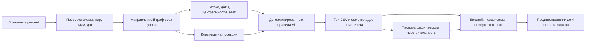

# MoneyGraph — Граф денег

Локальный pipeline CORE по формулам v1. Роли — гипотезы; role_score — сила
правила, priority_score — приоритет проверки, не вероятность правонарушения.
API и сеть для расчёта не нужны. Dashboard разрабатывается отдельно.

## Запуск

```bash
python -m venv .venv
source .venv/bin/activate
pip install -r requirements.txt
python run.py --data ./data --out ./out
python -m pytest tests/core -q
```

Нужны data/nodes.parquet, edges.parquet, transactions.parquet. Исходный
starter сохранён в starter/, README датасета — docs/dataset_README.md.
Данные, результаты и секреты исключены из Git.

Результаты: out/nodes_roles.csv, out/clusters.csv, out/top_nodes.csv.
Обязательные поля starter сохранены. Дополнительные поля: missing_inflow,
in_tx, out_tx, fast2, betweenness, scc_size, seed_sources, cross_nbrs,
score_<role>. top_gids — целые gid через `;`. Кластеры от 0, rank от 1.

## Метод и ограничения

Все узлы включаются до метрик. PageRank направленный, вес — сумма.
Betweenness: k=min(128,n), seed=42, расстояние
1/max(log1p(sum_kzt),1e-12), эвристика силы связи. SCC без перечисления циклов.
seed_sources — внешние seed с направленным путём до 4 рёбер.
Louvain: seed=42, ненаправленная проекция с суммой обоих направлений;
ID кластеров по минимальному gid. cross_nbrs — разные соседи других кластеров.

L(x)=clip(log1p(x)/log1p(q99_positive(x)),0,1); квантиль linear по положительным
значениям того же признака, при их отсутствии 0. Формулы ролей и приоритета
v1 без изменений реализованы в src/roles.py. Порог роли .55, равенство:
coordinator, transit, consolidator, distributor, terminal. Иначе peripheral
с силой 1-max(scores), ограниченной .35 для границы depth=4 без исходящих
и изолированных seed. Недопустимые баллы равны 0.

fast2 — возможный объём сопоставления входов и выходов за 0–2 календарных дня,
делённый на минимум общих сумм. FIFO использует каждую сумму один раз.
При отсутствии стороны 0. Совпадение дня не доказывает порядок или путь денег.
У seed входы неполны, fast2 исключён из временной компоненты приоритета.
pass_through=out_kzt/in_kzt; при отсутствии входа 0 и missing_inflow=True.
Этот ноль не доказывает отсутствие транзита. Depth=4 без исходящих — граница
выборки, а не доказанное оседание. Все суммы относятся к наблюдаемому графу.

## Проверка и время

CLI проверяет пары, суммы с абсолютным допуском .01 KZT, количества,
целочисленные gid, концы рёбер, даты июля 2026, роли, конечность, кластеры
и сортировку. Тесты включают синтетические границы и локальный датасет.
CLI печатает JSON со строками CSV и временем стадий, включая импорт.

```bash
time python run.py --data ./data --out ./out
python run.py --data ./data --out /tmp/moneygraph-repeat
diff out/nodes_roles.csv /tmp/moneygraph-repeat/nodes_roles.csv
diff out/clusters.csv /tmp/moneygraph-repeat/clusters.csv
diff out/top_nodes.csv /tmp/moneygraph-repeat/top_nodes.csv
```

Проверено на Fedora, Python 3.14: 10 тестов прошли (повторно за 2.23 с).
Реальные CSV: nodes_roles — 2248 строк, clusters — 91, top_nodes — 20.
Сверены 3119 пар и 4840 транзакций, сумма 365890012.01 KZT; включены
19 изолированных seed, 444 узла на границе глубины не названы terminal.
Все три CSV побайтово совпали при повторном запуске.

Полный первый запуск по выводу терминала — 3.54 с, повторный — 2.78 с
(включая импорт, без старта интерпретатора). Стадии повторного запуска:
импорт 1.289 с, загрузка/проверка .156 с, граф .026 с, признаки .027 с,
временные признаки .534 с, центральности .339 с, кластеры .130 с,
роли/приоритет .032 с, экспорт .243 с. C++ не требуется: полный запуск
укладывается в 4 с, крупнейшая вычислительная стадия занимает .534 с.
Версии проверенного окружения зафиксированы в requirements.txt.

Проверены пять реальных примеров по исходным транзакциям: активный seed,
изолированный seed, узел depth=4, транзитный кандидат и узел с максимальным
суммарным входом/выходом. Для каждого совпали суммы и число контрагентов.
У транзитного кандидата из 90000 KZT входа и 90000 KZT выхода только
40000 KZT можно сопоставить в окне 0–2 дня: fast2=4/9. Более ранние выходы
не сопоставляются с будущими входами. Это согласованность правил, не
измерение точности классификации без разметки.

Осталось организационно: создание ветки agent/core и коммит не выполнены
(доступ к .git ранее не разрешён); интеграция и проверка dashboard относятся
к UI-агенту. Данные и CSV не публиковались.

## Задача Freedom и архитектура решения

Предоставленное описание трека: AML-аналитик видит нижний уровень цепочки
и восстанавливает по переводам на четыре колена, кто выше собирает и
распределяет деньги. Основной сценарий MoneyGraph: известный gid →
наблюдаемые предшественники → объяснение приоритета → записка для проверки.
Полная шкала оценки жюри и дополнительные материалы трека не предоставлены.



Границы ответственности:

- `src/load.py` отвергает неконсистентные данные до расчёта.
- `graph.py`, `features.py`, `temporal.py`, `communities.py` считают наблюдения.
- `roles.py` — единственный источник формул ролей и приоритета.
- `export.py` проверяет контракт и записывает результаты.
- `report.py` сохраняет `out/run_report.json`: SHA-256 входов, исходного кода
  и CSV, версии библиотек, параметры, время стадий, сравнение с базовым
  рейтингом и чувствительность. Поле seconds.total в паспорте относится
  к расчёту до создания паспорта; итог CLI включает и его создание.
- `dashboard/data.py` проверяет экспорт независимо; UI не назначает роли.
- `dashboard/investigation.py` ищет один кратчайший направленный путь от
  каждого наблюдаемого предшественника к выбранному узлу: обратный BFS
  до 4 шагов, максимум 20 кандидатов по готовому приоритету. Это не
  восстановление движения конкретных денег и не доказательство иерархии.

Дополнительные `priority_part_*` в nodes_roles — семь взвешенных слагаемых,
их сумма равна priority_score. Формулы v1 и обязательные поля не изменены.
Записка скачивается локально пользователем из карточки; внешних вызовов нет.

## Проверка перед демонстрацией

Проверенное окружение: Python 3.14, Streamlit 1.64.0, Plotly 6.9.0;
версии прямых UI-зависимостей и CORE закреплены в requirements.

```bash
source .venv/bin/activate
python -m pip install -r requirements.txt -r dashboard/requirements.txt
python run.py --data ./data --out ./out
python -m pytest tests/core tests/ui -q
python bench/verify.py
python -m streamlit run dashboard/app.py -- --data ./data --out ./out
```

`bench/verify.py` дважды запускает pipeline в отдельных процессах во
временные каталоги, сверяет контракт, SHA-256 трёх CSV и паспорт. Измеряет
wall time вместе со стартом интерпретатора. Отчёт JSON намеренно не
побайтово детерминирован: времена запуска меняются, CSV детерминированы.

В реальном наборе топ-20 совпадает с простым рейтингом по
max(in_kzt,out_kzt) в 8 из 20 случаев. При исключении одного компонента
сохраняется от 14 до 20 позиций топ-20. Это анализ зависимости от правил,
не доказательство точности. На странице «Проверяемость» можно проверить
каждую величину. Хеши не являются цифровой подписью или гарантией
подлинности исходного датасета.

### Что показывать жюри

1. Начать с известного узла и показать предшественников до 4 шагов.
2. Объяснить роль через числа и приоритет через семь вкладов.
3. Показать направленные пары и проверить одну связь в исходной таблице.
4. Скачать записку с фактами и ограничениями для дальнейшей проверки.
5. Открыть паспорт, результаты тестов и повторяемость запуска.

Без размеченных ролей нельзя честно заявить precision/recall или
восстановление доказанной организованной группы. Следующее улучшение при
доступе владельца задачи — экспертная разметка контрольных узлов и оценка
качества ранжирования; текущая версия готовит проверяемые гипотезы.

Последняя проверка после расширения сценария Freedom: **25 tests passed**,
без пропусков, включая Streamlit AppTest (9.76 с). Два полных процесса
pipeline — **2.87 и 3.84 с**, CSV побайтово одинаковы; 2248/91/20 строк.
Нативное ускорение не требуется. Внешний вид в браузере остаётся отдельной
ручной проверкой; headless-тест не заменяет её.
